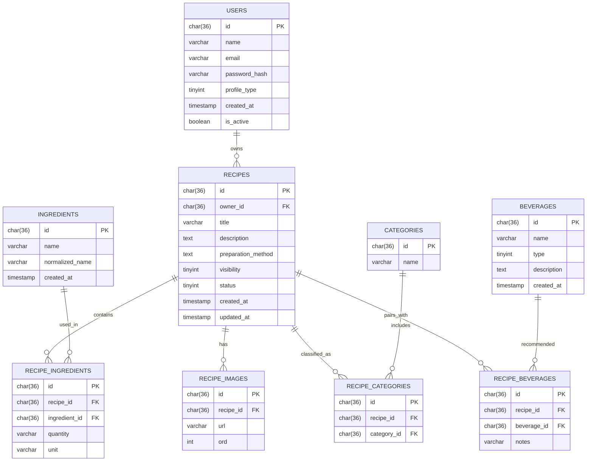

# Caderno de Receitas

```mermaid
erDiagram

    USERS ||--o{ RECIPES : owns
    RECIPES ||--o{ RECIPE_INGREDIENTS : contains
    INGREDIENTS ||--o{ RECIPE_INGREDIENTS : used_in
    RECIPES ||--o{ RECIPE_IMAGES : has
    RECIPES ||--o{ RECIPE_CATEGORIES : classified_as
    CATEGORIES ||--o{ RECIPE_CATEGORIES : includes
    RECIPES ||--o{ RECIPE_BEVERAGES : pairs_with
    BEVERAGES ||--o{ RECIPE_BEVERAGES : recommended

    USERS {
        char(36) id PK
        varchar name
        varchar email
        varchar password_hash
        tinyint profile_type
        timestamp created_at
        boolean is_active
    }

    RECIPES {
        char(36) id PK
        char(36) owner_id FK
        varchar title
        text description
        text preparation_method
        tinyint visibility
        tinyint status
        timestamp created_at
        timestamp updated_at
    }

    INGREDIENTS {
        char(36) id PK
        varchar name
        varchar normalized_name
        timestamp created_at
    }

    RECIPE_INGREDIENTS {
        char(36) id PK
        char(36) recipe_id FK
        char(36) ingredient_id FK
        varchar quantity
        varchar unit
    }

    RECIPE_IMAGES {
        char(36) id PK
        char(36) recipe_id FK
        varchar url
        int ord
    }

    CATEGORIES {
        char(36) id PK
        varchar name
    }

    RECIPE_CATEGORIES {
        char(36) id PK
        char(36) recipe_id FK
        char(36) category_id FK
    }

    BEVERAGES {
        char(36) id PK
        varchar name
        tinyint type
        text description
        timestamp created_at
    }

    RECIPE_BEVERAGES {
        char(36) id PK
        char(36) recipe_id FK
        char(36) beverage_id FK
        varchar notes
    }
```
